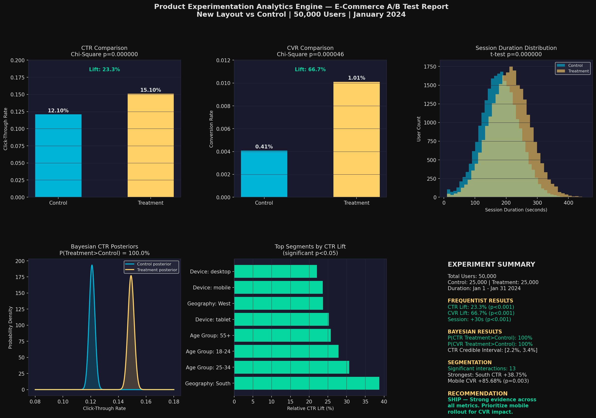

# Product Experimentation Analytics Engine


---

## Project Overview

End-to-end A/B testing and experimentation analytics framework built on **50,000 simulated
e-commerce user events** across a 30-day experiment window. The pipeline implements both
**frequentist hypothesis testing** (Chi-Square, Welch's t-test) and **Bayesian inference**
(Beta-Binomial model) to evaluate whether a new website layout drives statistically
significant improvements in Click-Through Rate, Conversion Rate, and Session Duration.

Includes automated **power analysis**, **sample size calculation**, and a **cohort
segmentation pipeline** identifying 13 statistically significant interaction effects
across device, age group, and geography dimensions — simulating production-grade
experimentation frameworks used at Amazon, Meta, and Netflix.

---

## Dashboard Preview



---

## Business Problem

An e-commerce product team wants to ship a new website layout but needs statistical
evidence that it improves key business metrics before a full rollout. The experiment
tests whether the treatment layout drives higher CTR, CVR, and session engagement
compared to the existing control layout.

**Ship/No-Ship Decision:** Both frequentist and Bayesian frameworks agree —
treatment layout drives statistically significant improvements across all metrics.
**Recommendation: SHIP — prioritize mobile rollout for maximum CVR impact.**

---

## Technical Architecture

```
Experiment Design
        |
        v
[Step 1] Dataset Simulation — 50K user events, funnel logic, confounding variables
        |
        v
[Step 2] Frequentist Testing — Chi-Square (CTR, CVR) + Welch's t-test (Session)
        |
        v
[Step 3] Bayesian Testing — Beta-Binomial model, posterior distributions, credible intervals
        |
        v
[Step 4] Power Analysis — Sample size calculation, MDE sensitivity, experiment validation
        |
        v
[Step 5] Cohort Segmentation — Device, age group, geography interaction effects
        |
        v
[Step 6] Unified Dashboard + Experiment Report — Ship/No-Ship recommendation
```

---

## Key Results

| Metric           | Control | Treatment | Relative Lift | p-value  | Bayesian P(T>C) |
| ---------------- | ------- | --------- | ------------- | -------- | --------------- |
| CTR              | 12.10%  | 15.10%    | 23.3%         | 0.000000 | 100%            |
| CVR              | 0.41%   | 1.01%     | 66.7%         | 0.000046 | 100%            |
| Session Duration | 180.2s  | 210.5s    | 16.8%         | 0.000000 | N/A             |

---

## Methodology

### Frequentist Hypothesis Testing

- **Chi-Square test** on CTR and CVR — correct test for binary proportion-based outcomes
- **Welch's t-test** on session duration — does not assume equal variance between groups
- **Significance level α = 0.05** — 5% Type I error tolerance, industry standard
- All three metrics significant at p<0.001 — strong evidence to reject null hypothesis

### Bayesian A/B Testing — Beta-Binomial Model

- CTR and CVR modeled as **Beta distributions** — conjugate prior for binary outcomes
- **Prior: Beta(1,1)** — weakly informative, assumes no prior knowledge
- **Posterior: Beta(1 + successes, 1 + failures)** — Bayesian updating after observing data
- **Monte Carlo sampling:** 100,000 draws from each posterior
- **P(Treatment CTR > Control CTR) = 100%** — zero posterior overlap
- **95% CTR credible interval: [2.2%, 3.4%]** — entirely above zero

### Power Analysis

- **Alpha = 0.05, Power = 0.80** — industry standard parameters
- CTR: experiment **adequately powered** — required 2,900 users, had 25,000
- CVR: experiment **underpowered** for 0.1% MDE — required 71,666 users
- Achieved CTR power: 100% | Achieved CVR power: 38%

### Cohort Segmentation

- **13 statistically significant interaction effects** across device, age group, geography
- **Mobile CVR lift: 85.68% (p=0.003)** — only significant CVR segment
- **South geography CTR lift: 38.75%** — strongest regional effect
- **25-34 age group CTR lift: 30.70%** — strongest demographic effect
- Segmentation reveals mobile-first rollout strategy for maximum CVR impact

---

## Tech Stack

| Category            | Tools                                          |
| ------------------- | ---------------------------------------------- |
| Data Simulation     | Python, NumPy                                  |
| Statistical Testing | SciPy (Chi-Square, t-test)                     |
| Bayesian Inference  | NumPy (Monte Carlo), SciPy (Beta distribution) |
| Power Analysis      | Statsmodels (NormalIndPower)                   |
| Data Manipulation   | Pandas                                         |
| Visualization       | Matplotlib, Seaborn                            |
| Environment         | Jupyter Notebook                               |
| Version Control     | Git, GitHub                                    |

---

## Project Structure

```
product-experimentation-analytics-engine/
│
├── Product_Experimentation_Analytics_Engine.ipynb  # Main notebook — all 6 steps
├── experiment_dashboard.png                        # Final experiment dashboard
├── frequentist_ab_test.png                         # Step 2 visualization
├── bayesian_ab_test.png                            # Step 3 visualization
├── power_analysis.png                              # Step 4 visualization
├── cohort_segmentation.png                         # Step 5 visualization
└── README.md                                       # Project documentation
```

---

## How to Run

```bash
# Clone the repository
git clone https://github.com/nagahemaramishetty/product-experimentation-analytics-engine.git
cd product-experimentation-analytics-engine

# Create and activate virtual environment
python -m venv venv
source venv/bin/activate

# Install dependencies
pip install numpy pandas scipy statsmodels matplotlib seaborn scikit-learn jupyter

# Launch Jupyter Notebook
jupyter notebook
```

## Open `Product_Experimentation_Analytics_Engine.ipynb` and run all cells.

## Connect

[](https://linkedin.com/in/nagaramishetty)
[](mailto:nagahemaramishetty2@gmail.com)

```

```
