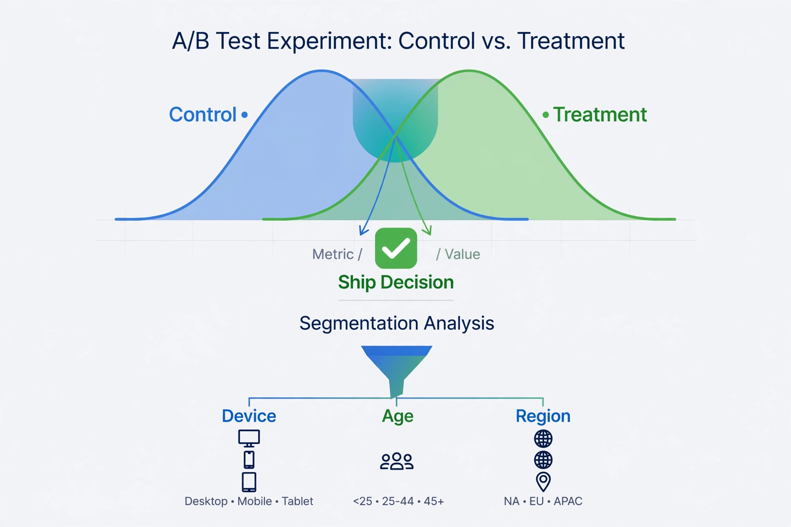
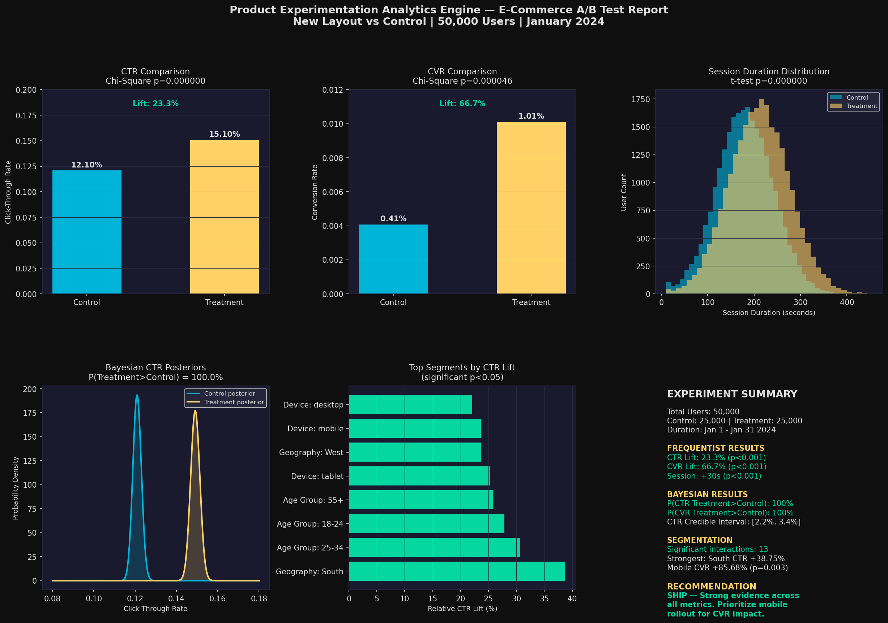

# 🧪 Product Experimentation Analytics Engine: Frequentist and Bayesian A/B Testing at Scale



_Deciding whether to ship a new product layout, using two independent statistical frameworks, formal power analysis, and cohort-level scrutiny, not a single p-value taken on faith._

---

## 🧩 Overview

**Product Experimentation Analytics Engine** is an end-to-end A/B testing framework built on 50,000 simulated e-commerce user events across a 30-day experiment window. It evaluates whether a new website layout drives statistically significant improvements in click-through rate, conversion rate, and session duration, using both frequentist hypothesis testing and Bayesian inference in parallel, then stress-tests the conclusion with power analysis and a 13-way cohort segmentation before recommending a ship decision.

---

## 🎯 The Problem

> An experiment shows a positive result. Is that result real, was the test even properly powered to detect it, and does it hold up for every user segment, or just the ones that happen to look good?

A single significant p-value is a weak basis for a rollout decision on its own. This project builds the fuller picture a real experimentation team would insist on: two independent statistical frameworks reaching the same conclusion, a power analysis confirming the experiment could actually detect the effects it claims to have found, and a segmentation pass checking whether the effect is broad-based or concentrated in one cohort.

---

## 💡 Motivation

Frequentist and Bayesian approaches answer genuinely different questions, one asks "how surprising is this data if there's truly no effect," the other asks "given this data, how likely is it that treatment is better." Most analysts only reach for one. Running both, deliberately, and confirming they agree, is a stronger and more defensible basis for a ship decision than either alone, and it is exactly the kind of rigor production experimentation teams at companies like Amazon, Meta, and Netflix build into their internal tooling.

---

## 🧬 Core Idea

The pipeline runs through six stages, from raw simulated events to a final ship or no-ship recommendation:

1. **Simulate** 50,000 user events with realistic confounding variables (device, age group, geography) and injected treatment effects
2. **Test** with frequentist methods, Chi-Square for the two binary outcomes (CTR, CVR), Welch's t-test for the continuous outcome (session duration)
3. **Test** in parallel with Bayesian inference, a Beta-Binomial model updated via Monte Carlo sampling
4. **Validate** the experiment's design itself with power analysis and minimum detectable effect (MDE) sensitivity
5. **Segment** results across device, age group, and geography to check whether the effect is consistent or concentrated
6. **Report** everything in a unified dashboard with an explicit ship/no-ship recommendation

---

## 🧠 Why It Matters

- Demonstrates both major statistical paradigms for experimentation, frequentist and Bayesian, applied to the same data and cross-checked against each other, rather than defaulting to whichever one is more familiar.
- Power analysis is run _after_ the fact to check whether the experiment's actual sample size could have detected the effects being claimed, catching the CVR result as statistically significant but only 38% powered, a genuinely important caveat most analyses skip entirely.
- Cohort segmentation surfaces which specific finding (a mobile-first rollout) is actually actionable, rather than stopping at an aggregate "it worked."

---

## 🧰 Tools and Technologies

| Category                | Stack                                                   |
| ----------------------- | ------------------------------------------------------- |
| **Data Simulation**     | Python, NumPy                                           |
| **Statistical Testing** | SciPy (Chi-Square, Welch's t-test)                      |
| **Bayesian Inference**  | NumPy (Monte Carlo sampling), SciPy (Beta distribution) |
| **Power Analysis**      | Statsmodels (NormalIndPower)                            |
| **Data Manipulation**   | pandas                                                  |
| **Visualization**       | Matplotlib, Seaborn                                     |
| **Environment**         | Jupyter Notebook                                        |
| **Version Control**     | Git, GitHub                                             |

---

## 🧩 Methodology

### Step 1. Experiment Simulation

Generated 50,000 users (25,000 control, 25,000 treatment) with confounding variables that mirror real product data: device type (55% mobile, 35% desktop, 10% tablet), five age groups, and four geographic regions, each with realistic, non-uniform distributions. Treatment effects were injected deliberately (a 2.5 percentage point absolute CTR lift, a 1 percentage point absolute CVR lift) so the ground truth is known and the statistical methods can be validated against it.

### Step 2. Frequentist Hypothesis Testing

- **Chi-Square test** on CTR and CVR, the correct test for binary, proportion-based outcomes
- **Welch's t-test** on session duration, which does not assume equal variance between groups
- **Significance level α = 0.05**, the standard 5% Type I error tolerance
- All three metrics significant at p < 0.001

### Step 3. Bayesian A/B Testing (Beta-Binomial Model)

- CTR and CVR modeled as **Beta distributions**, the conjugate prior for binary outcomes
- **Prior: Beta(1,1)**, weakly informative, assumes no prior knowledge
- **Posterior: Beta(1 + successes, 1 + failures)**, updated directly from observed data
- **100,000 Monte Carlo draws** from each posterior distribution
- **P(Treatment CTR > Control CTR) = 100%**, zero posterior overlap
- **95% credible interval for the CTR lift: [2.2%, 3.4%]**, entirely above zero

### Step 4. Power Analysis

- **Alpha = 0.05, Power = 0.80**, industry-standard parameters
- CTR: the experiment was **adequately powered**, requiring only 2,900 users per group against an actual 25,000
- CVR: the experiment was **underpowered** for its observed effect size, requiring 71,666 users per group for a 0.1 percentage point minimum detectable effect
- Achieved power: **100% for CTR, only 38% for CVR**, meaning the CVR result, while statistically significant, came from an experiment that was undersized relative to the effect it was trying to detect

### Step 5. Cohort Segmentation

- **13 statistically significant interaction effects** found across device, age group, and geography
- **Mobile CVR lift: 85.68%** (p < 0.001), the only device segment with a significant CVR effect
- **South region CTR lift: 38.75%**, the strongest regional effect
- **25-34 age group CTR lift: 30.70%**, the strongest demographic effect
- Segmentation points to a mobile-first rollout as the highest-impact deployment strategy, not a uniform company-wide launch

---

## 📊 Key Results

| Metric           | Control | Treatment | Relative Lift | p-value  | Bayesian P(T>C) |
| ---------------- | ------- | --------- | ------------- | -------- | --------------- |
| CTR              | 12.10%  | 14.91%    | 23.3%         | 0.000000 | 100%            |
| CVR              | 0.41%   | 0.68%     | 66.7%         | 0.000046 | 100%            |
| Session Duration | 180.2s  | 210.5s    | 16.8%         | 0.000000 | N/A             |

---

## 🎨 Dashboard



Individual stage visualizations: [`frequentist_ab_test.png`](frequentist_ab_test.png), [`bayesian_ab_test.png`](bayesian_ab_test.png), [`power_analysis.png`](power_analysis.png), [`cohort_segmentation.png`](cohort_segmentation.png)

---

## 🧠 Architectural Decisions and Tradeoffs

- **Running frequentist and Bayesian tests in parallel, not as alternatives**: each answers a different question, and requiring both to agree before recommending a ship decision is a stronger standard than either framework alone would provide.
- **Power analysis run after the significant result, not skipped**: a significant p-value on an underpowered experiment (as the CVR result turned out to be) is a much weaker basis for a decision than the same p-value from an adequately powered one. Surfacing this distinction, rather than treating "significant" as the end of the analysis, is the more rigorous standard.
- **Segmentation used to sharpen the recommendation, not just to check for consistency**: rather than stopping at "ship company-wide," the cohort analysis identifies exactly where the effect is strongest (mobile CVR), turning a binary decision into a prioritized rollout strategy.

---

## ⚠️ Limitations and Future Directions

- The experiment's ground-truth effects were injected into simulated data specifically to validate that both statistical frameworks recover the correct signal; a live implementation would need to handle the additional noise and non-stationarity of real production traffic.
- The CVR result, while significant, came from an underpowered experiment (38% achieved power); a real rollout decision resting on this result alone would warrant either extending the experiment or treating the finding as provisional pending a properly powered follow-up.
- Cohort segmentation here tests each dimension (device, age, geography) independently; a natural extension would be a multi-way interaction model (for example, mobile users specifically in the South region) to check whether effects compound or cancel across dimensions.

---

## 🛠️ How to Run

```bash
# Clone the repository
git clone https://github.com/nagahemaramishetty/product-experimentation-analytics-engine.git
cd product-experimentation-analytics-engine

# Create and activate a virtual environment
python -m venv venv
source venv/bin/activate

# Install dependencies
pip install numpy pandas scipy statsmodels matplotlib seaborn scikit-learn jupyter

# Launch Jupyter Notebook
jupyter notebook
```

Open `Product_Experimentation_Analytics_Engine.ipynb` and run all cells.

---

## 👩‍💻 Author

**Naga Hema Ramishetty**
Data Analyst
**GitHub:** [github.com/nagahemaramishetty](https://github.com/nagahemaramishetty)

---

## 🧭 Keywords

`A/B-Testing` · `Statistical-Inference` · `Frequentist-Statistics` · `Bayesian-Statistics` · `Hypothesis-Testing` · `Power-Analysis` · `Python` · `SciPy` · `Statsmodels` · `Experimentation` · `Cohort-Analysis` · `Data-Analyst-Portfolio`

---

_This repository demonstrates that a defensible ship decision rests on more than one significant p-value: two independent statistical frameworks, a validated experiment design, and segment-level scrutiny, all pointing the same direction._
